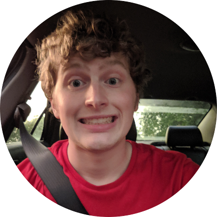

## About Me

Hello! I am a Cyber Security Intern @ Idaho National Laboratoy (INL) who recently graduated from Dakota State University. If you don't know me well, my main interests are malware analysis, reverse engineering, and - broadly - cars (e.g. my [2006 Suzuki Grand Vitara XSport](suzuki.jpg)).

I have an orange tabby named, [Clover](clover.jpg). The #1 love of my life 🐱.

## Research Interest

🚧 🚧 🚧 CONSTRUCTION ZONE 🚧 🚧 🚧

## Education

**Dakota State University, Madison, SD** - M.S. Computer Science

Graduated Fall 2020

GPA 4.0

**Dakota State University, Madison SD** - B.S. Cyber Operations

Graduated Fall 2019

GPA 3.6

## Experience

**Idaho National Laboratory - Idaho Falls, ID** - Cyber Security Intern

May 2020 - Current

* Broad understanding of threat intelligence formats and conversion techniques (MISP/Mitre Attack/TAXII/STIX)
* Use of relational graphs for both supervised and unsupervised machine learning modeling of extracted features from raw samples and threat intel
* Use of reverse engineering tools (IDA/Binary Ninja/Angr) for analysis ofmalware and extracted firmware.
* Remote/Telecommute from home office

**Northrop Grumman - Cincinnati, OH** - Cyber Security Intern

May 2019 - August 2019

* Vulnerability research
* Hardware hacking over serial debug ports (JTAG/UART) with Shikra
* Bootloader memory scraping and firmware disassembly with Ghidra/Radare2
* Held an interim top-secret clearance

**First Financial Bank USA - Sioux Falls, SD** - Cyber Security Analyst

Februrary 2018 - May 2019

* Used collated information to identify, analyze, and report events that occur or might occur within the network to protect information, information systems, and networks from threats.
* Security Information and Event Management (SIEM)
* Incident Response/Policy Creation
* Remote/Telecommute from home office

**Dakota State University - Madison, SD** - Volunteer TA

January 2018 - Spring 2019

* CSC-304 Assembly Language

**Dakota State University - Madison, SD** - Cyclops Student Researcher

August 2017 - December 2018

* Sandboxing/Creating complete VM environments (VMWare, VirtualBox, Docker)
* Dynamic/Static analysis of malicious binaries (IDA/Radare2/Ghidra)
* Recognizing executable file formats (PE, ELF)
* Detection of packers/obfuscators
* Identifying use of Windows API (DLLs/Libraries, Functions)
* YARA signature creation and scripting

## Awards

* [Award for Outstanding Undergraduate Research](SRI2019.jpg) - *South Dakota Student Research Poster Session, 2019*
* [SFS CyberCorps Scholarship](https://www.sfs.opm.gov/Overview-History.aspx) - Dakota State University/NSF

## Clubs

I am the founder and current President of Malwr Club (est. 2020) @ Dakota State University. 

Some relevant links:

[Website](https://malwr.club) | [Youtube](https://youtube.malwr.club) | [Google Drive](https://drive.malwr.club)

And I participated as a member of [DefSec](https://defsec.club/) @ DSU as well. As a part of the team for 2018 DOE CyberForce Competition, we placed fourth out of 70 teams nation-wide. [Team Picture](cyberforce.jpg).

I also competed at ISEAGE, another CCDC sort of competition. I forget what place we took. [Team Photo](ISEAGE.jpg).

## Publications

1. Flack, M; Kramer, N; Snyder, Z; Chona, E; Steckelberg, M; and Brizendine, B: *Bust-A-Binary: Active Attribution and Analysis of Malware Campaigns*
2. Flack, M; Brizendine, B: *Feature Extraction and Analysis of Binaries for Classification*
3. Flack, M; Foster, R: *Clustering Analysis of Binaries Across Compiler Optimizations*
4. Flack, M; Foster, R; Xu, S: **

## Projects

Collection of some of my projects over the years.

Year | Category  | Description
-----|-----------|------------
2014 | xxxx      | Lorem ipsum dolor sit amet, consectetur adipiscing elit.
2015 | xxxx      | Lorem ipsum dolor sit amet, consectetur adipiscing elit.
2014 | xxxx      | Lorem ipsum dolor sit amet, consectetur adipiscing elit.

---

## References

* Foo Bar: Head of Department, Placeholder Names, Lorem
* John Doe: Associate Professor, Department of Computer Science, Ipsum

---

> Picaso: Only put off till tomorrow what you are willing to die having left undone. 
>
> Me: Pretty much everything then.
